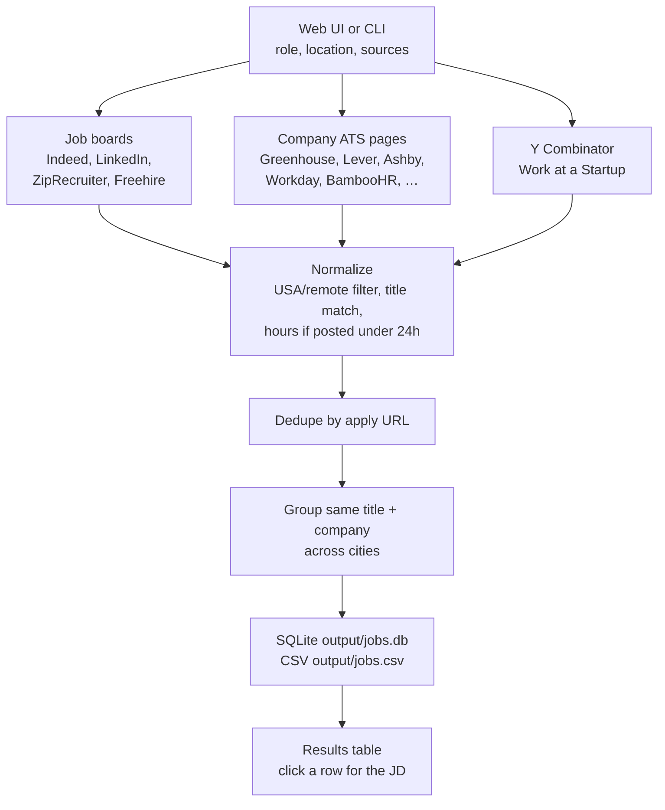

# USA job scraper

A personal job-search tool. You type a role, pick sources, and it pulls **US and remote** openings into a local page: job description, company, location, posted date, source, and apply link. It does not log in. It only reads public listings.

## How it works

One search hits three kinds of public feeds **at the same time**, then merges them into one table.



1. **You start a search.** The UI (or CLI) sends a role like `software engineer`, a location, and the boards/ATS chips you checked. Company slugs for ATS chips come from `config.yaml`.
2. **Sources run in parallel.** Indeed, LinkedIn, ZipRecruiter, and Freehire search by role. Each ATS company is fetched from that company’s own public career JSON/XML (the same feed their careers site uses). Y Combinator is one board-wide pull, not a per-company slug. A progress bar ticks as each board or company finishes.
3. **Each posting is normalized.** Title, company, location, posted date, description, and apply URL are mapped into one shape. **USA / remote only** drops non-US rows. The role query keeps titles that match. If a job is less than 24 hours old, the posted column shows hours (LinkedIn relative times included) instead of a blank date.
4. **Duplicates collapse.** The same URL is stored once; a re-fetch updates the row. The same title at the same company on the same source is grouped so the location column lists every city, each with its own posting link.
5. **You read results locally.** Rows land in `output/jobs.db` and `output/jobs.csv`. The page shows the table; click a row for the JD and location links. Apply still goes to the original company posting.

**Job boards** answer a search query. **ATS pages** dump that company’s open roles, then the scraper keeps the ones whose titles match your query. That is why Greenhouse/Lever/etc. need a slug (from the careers URL) while Indeed only needs `software engineer`.

Empty ATS entries in `config.yaml` (JazzHR, iCIMS, and similar) show as chips but return nothing until you add a slug or careers URL.

## Setup

Python 3.10+.

```powershell
cd "C:\Users\avina\OneDrive\Desktop\job scraper"
python -m venv .venv
.\.venv\Scripts\Activate.ps1
pip install -r requirements.txt
```

Edit `config.yaml` for the default search query and the company career-page slugs you care about.

## Web UI

This is the usual way to run it:

```powershell
python -m job_scraper.web
```

Open [http://127.0.0.1:8000](http://127.0.0.1:8000).

- Type a role (for example `software engineer`) and an optional location.
- Check the boards and ATS sources you want. LinkedIn and Workday start unchecked (slow / easy to rate-limit).
- Turn **USA / remote only** on to drop non-US postings.
- Click **Fetch jobs**. Rows load into the table; click a row for the description.

Company lists for ATS chips still come from `config.yaml`. Empty ATS entries (JazzHR, iCIMS, and similar) appear as chips but return nothing until you add a slug or careers URL.

## Command line

```powershell
python -m job_scraper
python -m job_scraper --query "data engineer" --location "Austin, TX"
python -m job_scraper --ats-only
python -m job_scraper --boards-only --no-linkedin
python -m job_scraper --out output/jobs.json
```

## What each source needs

| Source | What you put in `config.yaml` |
| --- | --- |
| Indeed, ZipRecruiter, LinkedIn | `query` and `location`. Keep `country_indeed: USA`. |
| Freehire | Same search query. Public Freehire job index (`countries=us` when USA-only is on). |
| Greenhouse | Slug from `boards.greenhouse.io/stripe` → `stripe` |
| Lever | Slug from `jobs.lever.co/spotify` → `spotify` |
| Ashby | Slug from `jobs.ashbyhq.com/openai` → `openai` |
| Workable | Slug from `apply.workable.com/huggingface` → `huggingface` |
| SmartRecruiters | Identifier from `jobs.smartrecruiters.com/Visa` → `Visa` (case can matter) |
| Recruitee | Subdomain from `acme.recruitee.com` → `acme` |
| BambooHR | Subdomain from `flyio.bamboohr.com/careers` → `flyio` |
| Personio | Subdomain from `acme.jobs.personio.com` → `acme` |
| Breezy | Subdomain from `acme.breezy.hr` → `acme` |
| Teamtailor | Subdomain from `acme.teamtailor.com` → `acme` |
| Pinpoint | Subdomain from `acme.pinpointhq.com` → `acme` |
| JazzHR | Subdomain from `acme.applytojob.com` → `acme` |
| Manatal | Career-page slug (from `careers-page.com/acme` or the Manatal board id) |
| Polymer | Organization slug from the Polymer hire board |
| iCIMS | Company id from `careers-{id}.icims.com`, or the full search URL |
| Paylocity | Company GUID or full `recruiting.paylocity.com` jobs URL |
| Paycom | `clientkey` from the Paycom jobs URL |
| SuccessFactors | Company id or the full career-site URL |
| Workday | Full board URL, e.g. `https://nvidia.wd5.myworkdayjobs.com/NVIDIAExternalCareerSite` |
| Y Combinator | `ycombinator: [all]` |

Workday needs the real careers URL (tenant + `wd1`/`wd5` shard + site name), not a company name. For Greenhouse, Lever, Ashby, Workable, and Workday you can paste that full URL instead of a slug.

```yaml
ats:
  greenhouse:
    - stripe
    - https://boards.greenhouse.io/airbnb
  workday:
    - name: NVIDIA
      url: https://nvidia.wd5.myworkdayjobs.com/NVIDIAExternalCareerSite
  ycombinator:
    - all
```

LinkedIn rate-limits aggressively on a single IP. Leave it unchecked in the UI unless you need it. Optional proxies:

```yaml
proxies:
  - "user:pass@host:port"
```

This is for personal job search against public listings. Respect each site’s terms of use.
